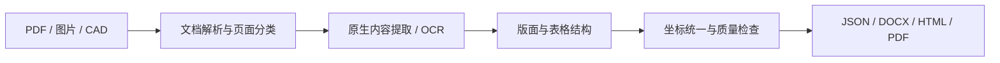

# OCR 与文档结构化系统

我独立负责 OCR 文档系统项目的设计、开发与部署，覆盖 PDF/图片解析、文字识别、版面分析、表格结构提取及结果输出。此仓库通过公开样本、演示结果和技术说明，展示系统实现与个人工程经验。

**个人职责：** 文档处理流程设计、模型与组件集成、结构化数据建模、结果输出、服务部署和质量评测。

**技术关键词：** Python · PaddleOCR · OpenCV · PyMuPDF · pdfplumber · RapidTable · FastAPI · Docker · ONNX Runtime

[工程 PDF 案例](cases/engineering-pdf.md) · [合并表格案例](cases/merged-table.md) · [评测方法](EVALUATION.md) · [样本来源与许可](CASE_SOURCES.md)

> 展示状态：已提供公开工程图的原生文字解析基线、自制表格输入及结构真值。公开样本的模型 OCR、完整服务输出和 Word 重建效果仍待实测。

## 1. 项目简介

系统面向扫描文档、图片和复杂 PDF，处理小字号文字、混合版面、表格与合并单元格，输出可检索、可编辑或可供下游系统消费的结果。

| 输入 | 处理内容 | 输出 |
|---|---|---|
| 原生、扫描及混合 PDF | 页面分类、文字层提取、页面渲染与 OCR 路由 | 文字、页面坐标、结构化 JSON |
| 图片与扫描页 | 文字检测、识别、方向处理、按场景补充识别 | 文字行、位置框及质量信息 |
| 含表格的文档 | 行列结构、单元格及合并关系提取 | 表格 HTML/JSON、可编辑 Word |
| CAD 文档 | 文字实体提取与几何背景渲染 | 文档转换所需的文字和图形数据 |

系统支持 JSON、DOCX、HTML 和 PDF 等输出；具体输出路径根据输入类型及转换模式选择。

## 2. 效果展示

### 工程 PDF：原生文字解析基线


蓝色框线来自 PDF 原生文字层，展示文字与页面位置的对应关系。该基线由独立公开脚本生成，**不是模型 OCR 或完整项目服务的识别结果**。

- 输入：DEXPI C03 管道及仪表流程图。
- 当前结果：[原生文字与坐标 JSON](artifacts/c03-native-text.json)。
- 完整 OCR 输入：[180 DPI 页面 PNG](samples/c03-raster.png)，不含 PDF 文字层。
- 后续核查：设备编号、小字、规格标记与 OCR 位置框；Word 结果待实测。
- [查看难点、方法、复现命令和限制](cases/engineering-pdf.md)。

### 合并单元格表格：自制输入与结构真值


样本包含跨行、跨列合并，以及 `Ø、±、°` 等工程标注。逻辑网格为 **6 行 × 5 列**，共 **21 个物理单元格、5 个合并单元格**。

- 输入：[原生表格 PDF](samples/merged-table-source.pdf)、[纯图像扫描 PDF](samples/merged-table-scan.pdf)。
- 参考：[人工定义的结构与文字真值](artifacts/merged-table-ground-truth.json)，使用 `rowspan` / `colspan` 表达合并关系。
- 表格 OCR、结构预测与可编辑 Word 输出：**待实测**。
- [查看单元格核查方法与复现命令](cases/merged-table.md)。

## 3. 个人贡献

我独立负责本项目的 OCR 文档系统，将通用开源能力接入实际文档流程，并完成业务编排、异常处理与结果交付。

| 工作方向 | 负责的实现与改进 | 使用的开源基础 |
|---|---|---|
| 文档解析 | 区分原生、扫描与混合 PDF；统一页面、文字、表格和图片的内部表示 | PyMuPDF、pdfplumber |
| OCR 流程 | 组织检测与识别、语言和模型路由、模型回退、方向处理及工程小字补识别 | PaddleOCR、OpenCV |
| 版面与表格 | 集成版面/表格后端，结合几何方法补充结构；保留页内坐标及合并单元格信息 | PaddleOCR 版面组件、RapidTable、OpenCV |
| 输出服务 | 将结构化结果接入 JSON、Word、HTML/PDF 输出及同步/异步任务接口 | FastAPI、文档渲染组件 |
| 部署与评测 | Docker 部署、CPU/ONNX 推理适配、离线模型校验、任务日志及质量/耗时评测 | Docker、ONNX Runtime、Python 测试工具 |

模型检测与识别能力来自开源模型；我的工作重点是系统设计、集成、工程适配、质量核查与部署交付。模型微调和主动学习尚未作为本展示的已完成成果。

## 4. 技术方案



原生 PDF 优先利用有效文字层；扫描页和图片进入 OCR。各阶段共用页面与结构数据，保留文字、位置、单元格跨度及诊断信息，供输出和人工核查使用。

### 公开代码示例：统一 PDF 与图像坐标

以下片段来自本仓库的[独立演示脚本](tools/prepare_examples.py#L81-L90)。`source` 是输入 PDF，`image` 是同一页面的完整栅格图；根据实际页面与图像尺寸换算坐标，同时保留 PDF 点坐标与图像像素坐标，便于位置框叠加及结果核查。

```python
with pdfplumber.open(source) as document:
    page = document.pages[0]
    sx, sy = image.width / page.width, image.height / page.height
    words = []
    for word in page.extract_words():
        box = [word["x0"], word["top"], word["x1"], word["bottom"]]
        pixel_box = [round(box[0] * sx), round(box[1] * sy),
                     round(box[2] * sx), round(box[3] * sy)]
        words.append({"text": word["text"], "bbox_pdf_points": box,
                      "bbox_pixels": pixel_box})
```

对应结果见[文字与坐标 JSON](artifacts/c03-native-text.json)。这是 PDF 原生文字提取，不能作为模型 OCR 准确率的证据。当前演示处理第一页，以完整页面、左上角坐标为基准；裁剪、旋转或透视变换需要另行记录与应用相应的坐标变换。

## 5. 与工程 PDF 岗位对应的能力

| 岗位关注点 | 当前可展示内容 | 本仓库的证据状态 |
|---|---|---|
| PDF/图像处理与 OCR | 文档路由、页面渲染、文字检测识别、工程页小字补识别 | 系统已有实现；公开样本 OCR 待实测 |
| 布局与混合表格 | 版面分析、表格后端与几何补充、合并单元格结构 | 系统已有实现；已提供公开表格真值 |
| 结构化与可编辑输出 | 页面/文字坐标 JSON、表格 HTML、Word/PDF 输出流程 | 系统已有实现；本案例的服务/Word 输出待实测 |
| 部署与运行维护 | Docker、CPU 和 ONNX 后端、模型文件校验、任务日志 | 系统已有实现；当前案例未调用完整服务 |
| 质量评估 | CER/WER、检测召回、表格结构、失败率及延迟统计工具 | 已有评测框架；公开案例分数待实测 |
| 工程符号与 P&ID 连接关系 | 后续独立检测、类别识别和连接关系研究 | 后续方向，尚未实现完整能力 |

## 6. 评测与限制

- **已有实现**：上述文档处理、OCR、表格、输出与部署流程。
- **已完成的公开基线**：C03 原生文字提取、位置框预览、自制表格与结构真值；[环境、参数与校验值](artifacts/case-metadata.json)可检查。
- **待实测**：公开样本的模型 OCR、表格识别、Word 效果及质量/耗时指标。
- **后续方向**：工程符号分类、P&ID 管线连通性、模型微调及主动学习。

工程字符保护是对已提取标注的保留与核查规则，不能据此推断特殊字符识别准确率。CAD 图元提取和几何渲染也不能替代设备符号的语义分类。

准确率和速度只在附带样本、标注、模型版本、运行环境与测量方法时发布。目前不填写示意分数或推测的生产性能。[详细评测口径](EVALUATION.md)

## 7. 案例复现与来源

### 独立复现公开基线

使用 Python 3.11 或更新版本，在本展示仓库根目录运行：

```bash
python -m pip install -r requirements-demo.txt
python tools/prepare_examples.py --dpi 180
```

脚本下载缺失的 DEXPI 样本，提取原生文字、生成预览，并创建含合并单元格的表格 PDF、扫描 PDF 与真值。它不运行 OCR 模型，不依赖完整项目代码或服务。

表格使用系统中的 Arial 或 DejaVu Sans；找不到字体时，通过 `--font /path/to/Unicode-font.ttf` 指定。重新运行会更新基线和自制样本，实际依赖版本写入环境清单。

### 复测完整 OCR 与输出

两个[案例文档](cases/engineering-pdf.md)提供本地项目服务的请求示例。完整 OCR、结构化服务响应和 DOCX 输出需要另行部署系统及模型，展示包不包含完整系统源码或可直接启动的完整服务。公开基线可独立复现，完整系统结果需要对应运行环境。

### 来源与许可

- 工程样本：DEXPI 官方公开测试案例，仓库许可为 CC BY 4.0；保留原图和许可出处。
- 表格样本：本展示自行制作，按 CC0 1.0 提供。
- 文档与公开样本准备工具：按 CC BY 4.0 提供；不代表完整系统源码的许可。

[完整归属、修改说明及许可证](CASE_SOURCES.md) · [展示包许可](LICENSE.md)
