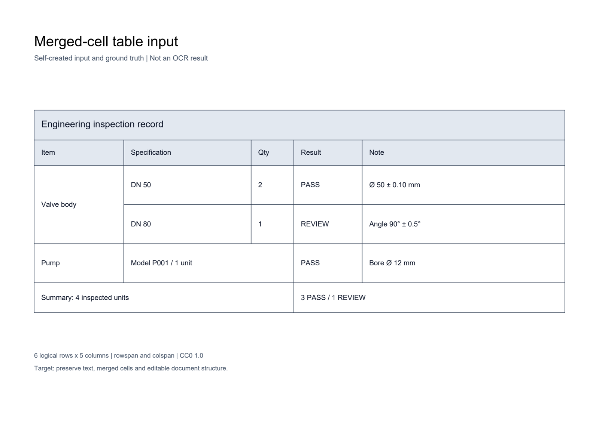
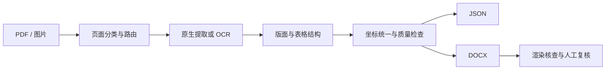

# OCR 与文档结构化系统

把 PDF、扫描页和工程图转换为带坐标、表格跨度及质量信息的结构化结果。我负责文档处理流程、模型集成、版式适配、服务部署与评测，关注识别结果如何继续用于编辑、检索和业务处理。

**Python · PaddleOCR · OpenCV · PyMuPDF · FastAPI · DOCX**

[真实图纸实测](cases/real-engineering-drawings.md) · [历史基线](EVALUATION.md) · [工程图案例](cases/engineering-pdf.md) · [合并表格案例](cases/merged-table.md) · [关键代码](examples/README.md) · [Agent / RAG 项目](https://github.com/YSADF/agent-rag-showcase)

## 机械 OCR 第二轮：结构恢复与漏符号拦截

同一 RTX 5090 重测旧版，再比较新版复核预算。沿用的 **20 张图纸 / 238 区域已转为开发／回归集**；本轮 140 次有效正式整页请求，另保留 20 次配置错误、未纳入预算对照的请求。原始报告不覆盖。

| 固定区域结果 | 旧工程模式 | 新工程模式 |
|---|---:|---:|
| 机械完整转写（含单元格类型要求） | 74/118，62.71% | 83/118，70.34% |
| D060322 目标进入有效单元格 | 0/10 | 10/10，文字完全匹配 9/10 |
| 17 处直径失败的对应区域明确标疑 | 4/17 | 17/17 |
| P&ID 完整转写 | 113/120 | 113/120 |

提升主要来自零件表结构恢复。**直径原文仍为 0/17 正确，20 页仍待复核。** medium/small 对完整直径裁剪都未正确输出符号，而单独数字均为 17/17；后续需要工程字形训练，不能靠全局替换掩盖错误。两组上下公差均有关联，完整组合候选为 1/2 正确，候选不计最终识别正确。

[第二轮报告、预算与耗时](cases/mechanical-ocr-round2.md) · [派生数据](artifacts/engineering-round2-20261008/README.md) · [精选公差代码](examples/engineering_tolerances.py)

## 真实图纸摸底：2026-10-08

在 RTX 5090 上比较普通模式（PP-OCRv6 small）与工程模式（medium + 原分辨率分块 + 工程字符复核）：**20 张真实项目图纸、238 个预先冻结区域、40 次完整页面推理**。包括 10 张 LIGO 机械图、8 张 Hanford P&ID、2 张 Johannesburg Water P&ID。[来源与页码](artifacts/real-drawings-20261008/SOURCES.md)

| 所选区域完整转写匹配率，包含表格类型要求 | 普通模式 | 工程模式 |
|---|---:|---:|
| 机械图，118 区域 | 58.47%（69/118） | 62.71%（74/118） |
| 管道仪表图，120 区域 | 90.00%（108/120） | 94.17%（113/120） |

**保持试验状态：**所选 17 个直径符号两组均误读或遗漏，工程模式 20/20 页待复核。`Ø1.046 → 1.046` 的错误置信度接近 100%，局部复识别也一致，暴露了单凭置信度和重复一致性检查的不足。待复核不计为验收正确。

机械分数还包含 10 个零件表目标被输出成文本行的结构问题；它不是纯识别器准确率。标注由助手目视核对后冻结，尚待独立人工复核；只覆盖选定区域，不能视为整页准确率。工程模式每页中位耗时：机械 13.35 秒、P&ID 33.77 秒；每页仅测一次，这是跨页面统计。

[完整报告与失败分析](cases/real-engineering-drawings.md) · [机器可读结果](artifacts/real-drawings-20261008/summary.json) · [离线复算](tools/score_real_drawings.py)

## 公开基线：2026-10-07

在单张 RTX 5090 32 GB 上调用实际项目服务，每例预热 2 次，再串行测量 20 次。语言 `en`、模式 `balanced`，启用版面分析。项目目录沿用 PP-V5 命名，**本轮实际 OCR 后端为 PP-OCRv6 small**，模型文件哈希随响应公开。

| 样本 | JSON 请求成功 | P50 / P95 | 质量核查 |
|---|---:|---:|---|
| DEXPI C03 工程图 PNG | 20/20 | 4.164 / 4.433 秒 | 可识别主要设备编号；小字和长说明有漏字、截断 |
| 自制合并表格扫描 PDF | 20/20 | 1.793 / 1.919 秒 | 单元格文字完全匹配 19/21；5 个合并关系全部匹配 |

表格的 203 个参考字符中有 2 个替换错误，CER **0.985%**：两处 `Ø` 被识别成 `∅`。21 个单元格的行列位置与跨度全部匹配。这只覆盖一张自制表，不能推断复杂表格的总体准确率。

**Word 导出仍有问题：** 两个 DOCX 均已生成，但 LibreOffice 渲染核查未通过，分别出现文字重叠、表格文字缺失及边框不完整。保留[原始输出、预览与逐项评分](artifacts/gpu-20261007/)，接口成功率与页面还原质量分别报告。

## 案例与证据

| 工程图：小字、旋转标签、线条干扰 | 表格：跨行跨列、工程字符 |
|---|---|
|  |  |
| [实际 OCR 响应](artifacts/gpu-20261007/engineering-response.json) · [案例分析](cases/engineering-pdf.md) | [实际 OCR 响应](artifacts/gpu-20261007/merged-table-response.json) · [逐格评分](artifacts/gpu-20261007/quality.json) |

## 重难点与我的实现

| 工程问题 | 处理方法与取舍 | 可检查的证据 |
|---|---|---|
| 字典覆盖、置信度高仍可能漏掉工程符号 | 原图分块、方向候选、模型字符覆盖与审计；真实测试仍发现漏符号，保留待复核 | [真实失败分析](cases/real-engineering-drawings.md) · [评分片段](examples/engineering_metrics.py) |
| 原生、扫描 PDF 走错链路会损失文字或重复识别 | 结合文字页比例与每页文字量选择 DOCX 路径；保留强制模式和探测失败回退 | [PDF 路由](examples/pdf_routing.py) |
| 译文变长，覆盖图线与相邻标签 | 有界搜索换行、字号、字距及横向比例，返回明确的 `fits` 状态；估算通过仍需渲染验证 | [Copy-fit 搜索](examples/copy_fit.py) |
| 编号、尺寸、符号被翻译或归一化改写 | 保存已确认片段的原始 Unicode，校验占位符数量、顺序与摘要，异常时返回原文 | [字符保护](examples/literal_guard.py) |
| 合并单元格同时包含文字与结构 | 统一 `row / col / rowspan / colspan`，分别检查文字、网格与输出效果 | [21 单元格结果](artifacts/gpu-20261007/quality.json) |
| PDF 点坐标与图像像素混用 | 按实际页面和栅格尺寸换算，保存坐标系和尺度 | [样本准备脚本](tools/prepare_examples.py) |

字符保护只能保留上游已经给出的字符，不能自动把 OCR 的 `∅` 判断为 `Ø`。结构化表格正确也不足以证明 Word 显示正确，需要独立的渲染质量检查。



检测、识别及版面模型来自开源项目；我的工作集中在流程设计、组件集成、字符与版式适配、异常处理和部署交付。符号语义分类、P&ID 管线连通性和模型微调不作为本轮已验证能力。

## 运行公开代码

独立示例与离线评分只需 Python 3.11+，无需完整业务源码或 GPU：

```bash
python -m unittest discover -s tests -v
python examples/literal_guard.py
python tools/score_results.py
python tools/score_real_drawings.py
python tools/score_round2.py
```

9 项独立示例测试通过。重新生成公开输入：

```bash
python -m pip install -r requirements-demo.txt
python tools/prepare_examples.py --dpi 180
```

对已部署的项目服务复测：

```bash
python -m pip install httpx numpy
python tools/benchmark_service.py --base-url http://127.0.0.1:8089 --runs 20
```

认证通过环境变量 `PPOCR_API_KEY` 设置。此仓库公开选取的算法、测试客户端、输入和实测产物；完整业务服务未开源，不能仅凭展示包重建全部系统。

## 下一步

- 直径完整裁剪仍稳定失败，按第二轮错误分类准备工程字形专项训练；继续核验上下公差候选，避免规则补字。
- 现有 20 张图纸已转为开发／回归集；另建按工程家族隔离、独立人工校对的新图纸验收集。
- 修复 Word 文本与背景重复叠加、表格显示异常，再用相同输入复测。
- 扩展小字、旋转标注、断线和倾斜表格的独立标注集。
- 增加 Word 与 LibreOffice 双渲染器检查，将页面交付质量纳入门禁。

[样本来源与许可](CASE_SOURCES.md) · [代码来源](CODE_PROVENANCE.json) · [展示许可](LICENSE.md)
