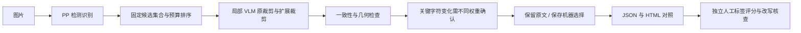
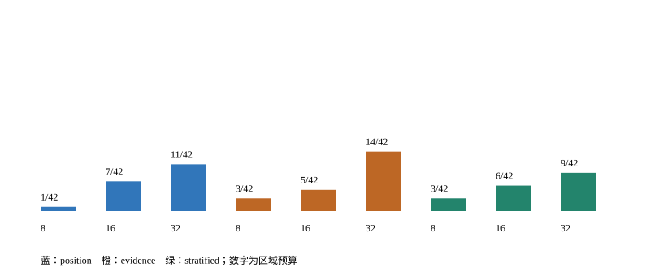

# 工程图 OCR＋局部 VLM 协同

**任务：在固定计算预算下找到值得交给 VLM 的 OCR 疑点，并减少错误改写。**

面向机械尺寸、工程符号与 P&ID 文字。沿用 PP-OCR 工程流程，局部适配 GLM-OCR 与 MinerU。
生产默认 `vlm_fallback=off`，展示显式使用 `evidence`；模型共识仍是待复核的机器选择。

我的贡献是疑点路由、预算控制、双视图/跨权重采用约束、几何与输出同步、评测及复现工具。
检测识别与视觉语言模型来自开源项目，本项目没有训练新的 OCR/VLM 权重。

**独立测试状态：20 页／200 个区域已预选，人工转写、10% 复查和新 GPU 实验待完成。尚无独立测试提升结论。**
选区来自 4 个与开发集隔离的来源家族，其中 3 页为 LANL 工程标准示例；机械图来自同一家厂商。
“提高 3 个百分点”是实验目标，不是已有成绩。

| 当前可核验的证据 | 结果 | 适用范围 |
|---|---|---|
| 已有 PP 工程流程 | 机械 83/118；P&ID 113/120 | 20 页开发／回归集，非独立验收 |
| 同候选池，32 区域静态路由 | position 11/42；evidence 14/42；stratified 9/42 | 进入预算的已知错误数，未扣时间预算，非纠正数 |
| 最小公开包 | infer / replay / score 与 6 项共用行为测试 | CPU 契约已验证，GLM/MinerU 新 GPU 兼容性待实测 |

新分桶策略没有胜出，因此保留默认排序。42 个已知错误中只有 33 个匹配到候选，排序本身无法解决候选遗漏。

| 工程图输入与原输出 | 表格输入与逐格结果 |
|---|---|
|  |  |
| [实际 OCR 输出](artifacts/gpu-20261007/engineering-response.json) | [实际 OCR 输出](artifacts/gpu-20261007/merged-table-response.json) · [评分](artifacts/gpu-20261007/quality.json) |

上面是历史服务实测输入输出；新增 GLM/MinerU 方案的六个最终案例仍待实际推理和人工核查。

## 运行入口

最小公开链路位于 [minimal-demo](minimal-demo/README.md)，与业务实现共用相同的路由、采用和序列化源码，附文件摘要。
实时推理需要本地 GPU、PP-OCR 权重和隔离的 VLM 环境；示例配置不是已验证的环境锁。

```bash
cd minimal-demo
python scripts/engineering_demo.py infer --image sample.png --config config.json --output run-001 --mode evidence
python scripts/engineering_demo.py replay --result run-001/result.json --output run-001/replay.html
python scripts/engineering_demo.py score --manifest labels.json --baselines baselines --results results --output score.json
```

推理入口不接收答案；回放只读取已保存结果；评分单独读取人工标签。最小包只演示文本行链路，不包含业务表格恢复和原分辨率分块，不能据此复现完整业务成绩。



## 路由预算对照



横轴是每页区域预算 8/16/32，不代表实际调用量或运行秒数。质量／实测成本曲线须待 GPU 实验完成。
[机器可读对照](artifacts/collaboration-20261009/summary.json) · [留出集选区与来源摘要](artifacts/collaboration-20261009/holdout-selection.json) · [三分钟讲解与验收要求](cases/ocr-vlm-collaboration.md)

## 验证与历史

原有独立示例测试为 20 项；新增最小包共用行为测试为 6 项，两套分别运行：

```bash
python -m unittest discover -s tests -v
python tools/score_round3.py
cd minimal-demo
python -m pip install -r requirements-test.txt
python -m pytest tests -q
```

完整业务工作区本轮相关测试为 212 项，范围大于公开包，不能把这个数量当成公开仓库的测试数。
[历史实验与成本记录](HISTORY.md) · [第三轮 VLM 对照](cases/engineering-vlm-round3.md) · [第四轮待测项](cases/engineering-fallback-round4.md)

[样本来源与许可](CASE_SOURCES.md) · [代码来源](CODE_PROVENANCE.json) · [展示许可](LICENSE.md)
