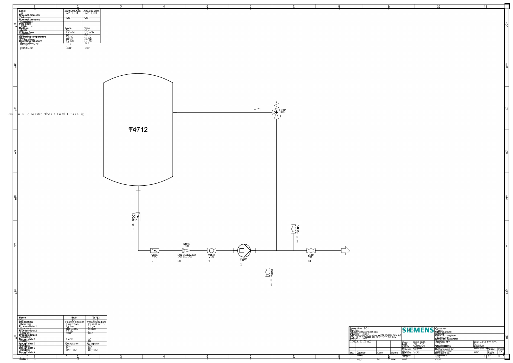

# 工程图：从扫描识别到版式交付

[返回首页](../README.md) · [评测口径](../EVALUATION.md) · [来源与许可](../CASE_SOURCES.md)

输入为 DEXPI C03 管道及仪表流程图。先保存原生 PDF 提取基线，再将页面渲染为 180 DPI PNG，只把无文字层的 PNG 交给 OCR 服务。

页面包含细线、旋转标签、设备编号、小字号说明和表格。难点在于保留文字与几何位置的对应关系，并防止重建文字和图像背景重复叠加。

## 实测观察

- 20 次正式 JSON 请求全部成功；P50 4.164 秒，P95 4.433 秒。
- 可见 `T4712`、`H001`、`R002`、`P001`、`V001` 等编号；这是逐项观察，不能折算为整页准确率。
- 长说明出现 `Positive-displace`、`Vessel with dishe` 等截断，系统将页面标为 `review`。
- DOCX 已生成，但 LibreOffice 预览有文字重叠，视觉验收未通过。

| 证据 | 用途 |
|---|---|
| [原始 PDF](../samples/c03-source.pdf) / [OCR 输入 PNG](../samples/c03-raster.png) | 核查输入与分辨率 |
| [原生文字 JSON](../artifacts/c03-native-text.json) | 226 个提取片段，仅作标注辅助 |
| [实际 OCR JSON](../artifacts/gpu-20261007/engineering-response.json) | 文字、位置框、诊断与模型配置 |
| [原始 DOCX](../artifacts/gpu-20261007/engineering-output.docx) / [渲染 PDF](../artifacts/gpu-20261007/engineering-render/engineering-output.pdf) | 独立检查文档交付效果 |

原生提取有断词与重叠，不能直接当作整页真值。本轮不报告全文 CER、检测召回、符号分类或管线连通性分数。图元渲染和 OCR 标签识别不能替代 P&ID 拓扑解析。

下一步核查重建文字的来源归属、背景清理和版式边界，再建立小字与旋转标注真值。

来源：[DEXPI TrainingTestCases](https://gitlab.com/dexpi/TrainingTestCases)。原图与衍生数据保留 CC BY 4.0 归属，详见[来源清单](../CASE_SOURCES.md)。
