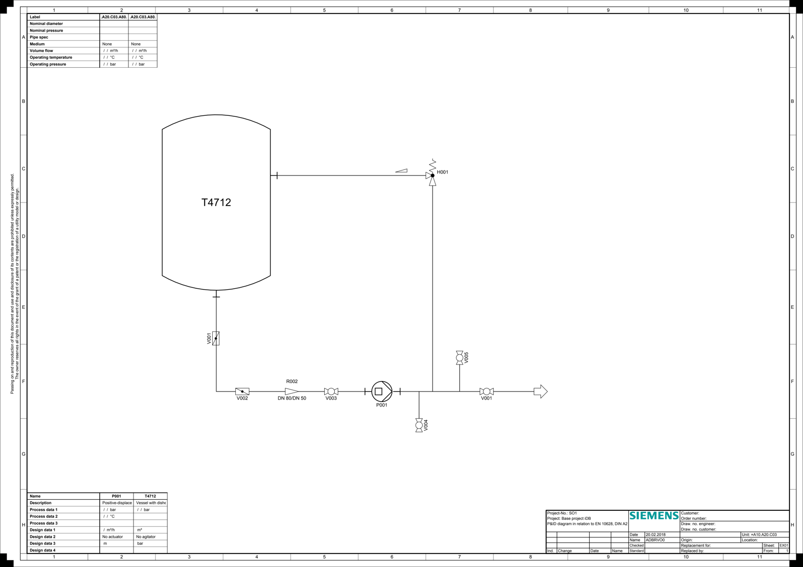
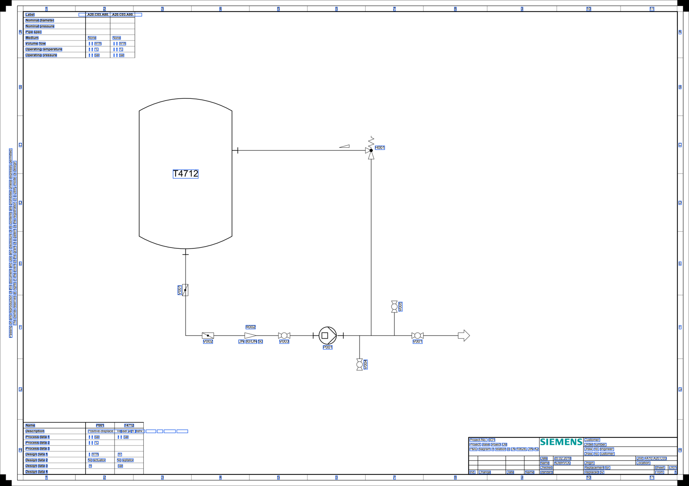

# 案例一：工程 PDF 文字与坐标提取

[返回项目首页](../README.md) · [样本来源与许可](../CASE_SOURCES.md) · [评测方法](../EVALUATION.md)

使用 DEXPI C03 管道及仪表流程图，展示工程 PDF 的文字层提取基线，并准备页面栅格化后的 OCR 评测。当前已发布输入、原生文字位置框和原生文字 JSON；OCR、符号分类与连接关系尚未完成本样本实测。

## 输入难点

- 设备、管线、阀门图形与短标签集中在同一页面，编号容易与普通说明混淆。
- 管线旁小字、数字及标点需要逐项核对；只判断全文是否“看起来合理”容易漏掉编号错误。
- PDF 自带文字层，直接提取成功不能证明扫描图 OCR 成功。两条路径必须分别记录。



原始文件：[c03-source.pdf](../samples/c03-source.pdf)。本图用于设备编号、管线编号、规格标记和说明文字评测；机械尺寸、公差及 `Φ、±、°` 等字符的覆盖情况需另行统计，不能据此推断全部工程字符能力。

## 处理方法

1. 公开演示脚本用 pdfplumber 读取 PDF 原生文字及位置框，保存页面尺寸、坐标和提取方法，作为可检查的基线；公司系统的原生 PDF 提取使用 PyMuPDF，两者分别标记。
2. 将同一页按 180 DPI 渲染成完整 PNG，后续只向 OCR 服务提交 `samples/c03-raster.png`，让识别输入不含 PDF 原生文字层。首页图片是缩小预览，不能作为完整页坐标基准。
3. OCR 结果按编号、规格和说明分别核对，保存文字、坐标、识别配置及质量信息；编号与几何位置匹配后再统计结果。

现有系统包含 PDF 原生内容提取、图片 OCR、工程页小字号英文补识别和结构化输出。工程字符保护用于避免编号、尺寸及符号被翻译改写；CAD 几何处理用于渲染线条、圆弧等实体。这些能力需要与本案例的实际识别结果分开表述。

## 当前结果



上图框线来自 PDF 原生文字层。它们没有经过 OCR 模型检测，不代表模型对小字或符号的识别效果。

| 产物 | 状态与含义 |
|---|---|
| 页面输入与原生文字框预览 | 已提供，便于定位和人工核查 |
| [c03-native-text.json](../artifacts/c03-native-text.json) | 已提供；独立公开脚本的原生文字提取结果，不是公司服务响应 |
| 页面栅格化 OCR JSON 与识别框 | 待实测 |
| Word 重建与页面效果 | 待实测 |
| 符号类别、标签绑定、P&ID 连接关系 | 后续方向 |

本次以 180 DPI 渲染为 4210 × 2977 像素，原生提取记录了 226 个文字片段。该数量只描述本次文字层提取，并非字符准确率、OCR 检测召回或设备数量。当前可检查原生文字与坐标是否对齐；完整性仍需人工核对。未标注并比对 OCR 输出前，不给出字符准确率、编号准确率或推理速度。

## 待验证

- 按原图人工核对设备编号、管线编号、数字和标点，建立校订后的文字真值；原生文字提取结果只作为标注辅助。
- 比对原生提取和 PNG OCR 的文字覆盖、坐标及漏检情况，检查小字和相似字符。
- 记录模型版本、运行设备、页面分辨率、预热方式及端到端耗时，再评估 CER、编号完全匹配率和位置覆盖。
- 单独建立符号与连接关系真值；当前案例不会把 OCR 文字框当作设备符号检测框。

## 复现参数

在展示包根目录执行 `python tools/prepare_examples.py` 可重建公开基线，默认渲染 180 DPI。运行环境、渲染参数与文件校验值记录在[评测文档](../EVALUATION.md)和[来源清单](../CASE_SOURCES.md)。公开样本和基线脚本可独立使用；完整项目 OCR 和 DOCX 重建需要已部署的项目服务与相应模型，本展示包不包含公司实现。

以下是供本地项目服务运行的 **Bash** 请求示例，应在展示包根目录执行。示例未在当前案例运行，也不产生已实测结论。`localhost:8089` 是示例地址，认证按本地服务配置设置；不需要连接公司生产服务。

```bash
mkdir -p results/engineering
curl --fail --show-error \
  http://127.0.0.1:8089/api/v1/ocr/file/sync \
  -F 'file=@samples/c03-raster.png' \
  -F 'output_format=json' \
  -F 'use_layout=true' \
  -F 'ocr_lang=en' \
  -F 'ocr_mode=balanced' \
  -F 'conversion_mode=ocr' \
  -o results/engineering/ocr-response.json
```

该接口的 JSON 响应包含 `full_text`、`regions`、`pages`、`stats` 等字段；文字行附带坐标。复测时保留完整响应，再从中生成 OCR 框预览。服务响应与 `c03-native-text.json` 的格式不同，比较前统一到 `samples/c03-raster.png` 的完整页像素坐标；缩小预览不能直接用于比较。

若要补充 Word 展示，在上述请求中改为 `output_format=docx`、加入 `direct_download=true`，并将输出保存为 `results/engineering/ocr-output.docx`。随后检查文字内容与页面效果，完成检查后才把预览放入项目首页。

## 来源

样本来自 [DEXPI TrainingTestCases](https://gitlab.com/dexpi/TrainingTestCases)，路径为 `dexpi 1.2/example pids/C03 DEXPI Example Tank Displ Pump Pipe with Tee/C03V01-SAG.EX01.pdf`。仓库采用 [CC BY 4.0](https://gitlab.com/dexpi/TrainingTestCases/-/blob/master/LICENSE)。页面 PNG 和框线图为该样本的渲染与标注衍生文件，保留 DEXPI 来源；详见[来源清单](../CASE_SOURCES.md)。
