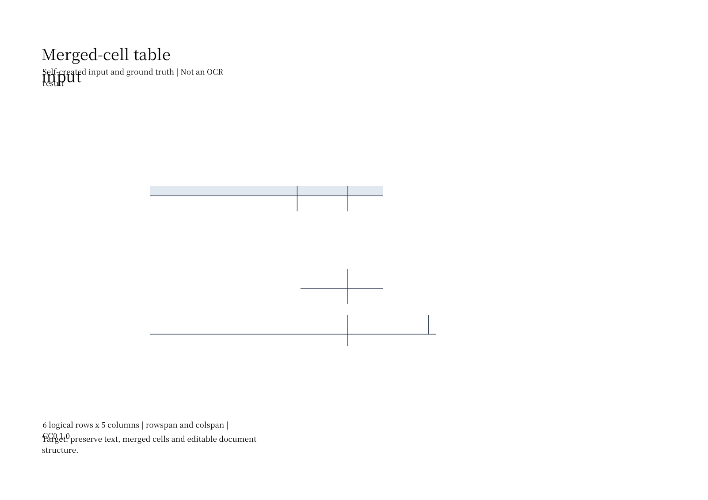

# 合并表格：结构正确，仍需验证 Word 交付

[返回首页](../README.md) · [评测口径](../EVALUATION.md)

自制英文工程检查表，6 行 × 5 列，21 个物理单元格、5 个合并单元格，包含 `Ø、±、°`。真值来自样本设计参数，OCR 输入为纯图像扫描 PDF。

| 检查项 | 实测结果 |
|---|---|
| JSON 请求 | 20/20 成功；P50 1.793 s，P95 1.919 s |
| 文字完全匹配 | 19/21 单元格 |
| CER | 2 个替换 / 203 个参考字符 = 0.985% |
| 行列位置与跨度 | 21/21 完全匹配 |
| 合并关系 | 5 个正确，无漏检或多检 |

两处错误为 `Ø 50 ± 0.10 mm → ∅ 50 ± 0.10 mm`、`Bore Ø 12 mm → Bore ∅ 12 mm`。评分保留 Unicode 差异，没有把两个符号视作相同。

## Word 输出边界

XML 包含原生表格与合并节点，但 LibreOffice 预览有表格文字缺失、边框不完整和文字重叠。JSON 中的 `accepted` 状态未发现这些交付问题。

本次视觉验收未通过，原文件未修饰。尚未验证 Microsoft Word，不能把 XML 结构存在等同于可编辑交付达标。

[扫描输入](../samples/merged-table-scan.pdf) · [结构真值](../artifacts/merged-table-ground-truth.json) · [OCR 响应](../artifacts/gpu-20261007/merged-table-response.json) · [逐格评分](../artifacts/gpu-20261007/quality.json) · [原始 DOCX](../artifacts/gpu-20261007/merged-table-output.docx) · [渲染 PDF](../artifacts/gpu-20261007/merged-table-render/merged-table-output.pdf)

自制输入与真值按 CC0 1.0 提供。整洁的合成表格只验证一个固定场景；后续应扩展倾斜、模糊、断线和不规则合并样本。
